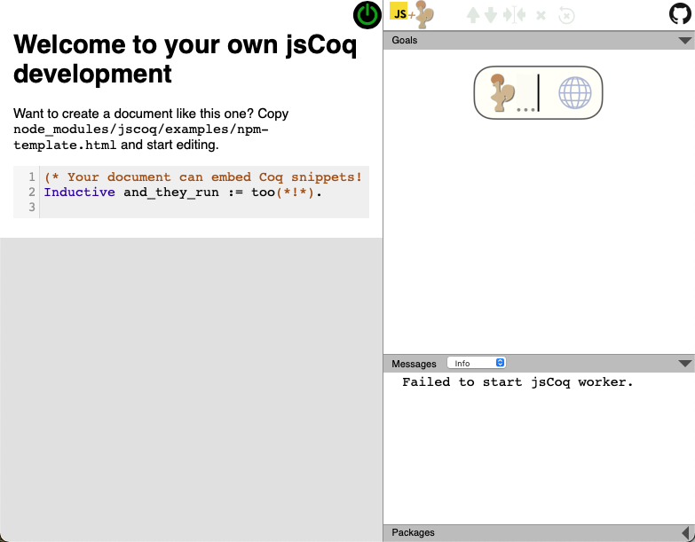

# docker_jscoq

jsCoqのDocker環境を提供する。

jsCoqについてはこちらから。
https://jscoq.github.io
## 必要なソフトウェアのインストール
DockerとDocker Composeがインストールされていること。

* [Dockerの入手](https://docs.docker.jp/get-docker.html)
* [Docker Compose のインストール](https://docs.docker.jp/compose/install.html)

## コンテナの起動と終了

コンテナ起動は以下のコマンドで行う。

```
docker-compose up -d
```
終了は以下のコマンドを実行する。

```
docker-compose down
```

## jsCoqの利用

コンテナが起動した状態で、ブラウザから

http://localhost:8080

をアクセすると、以下のような画面が表示される。


